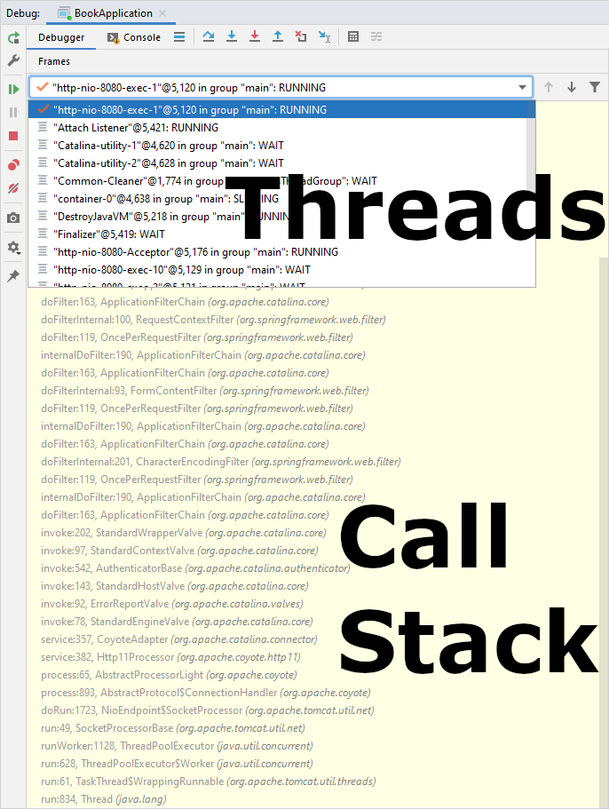
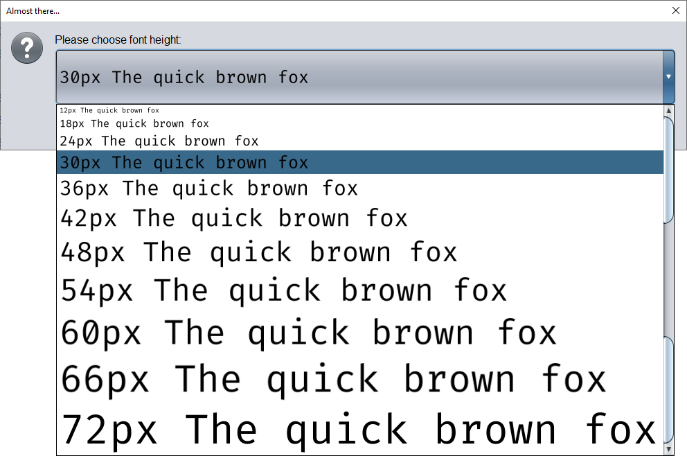
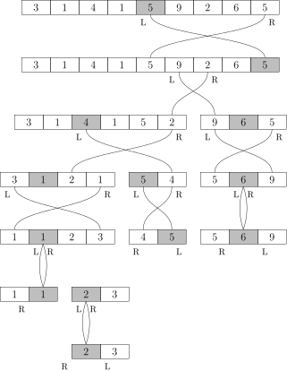
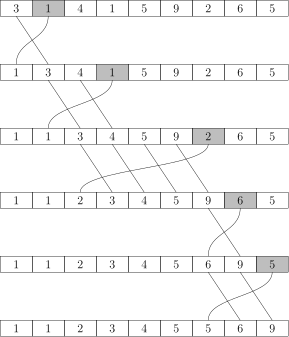
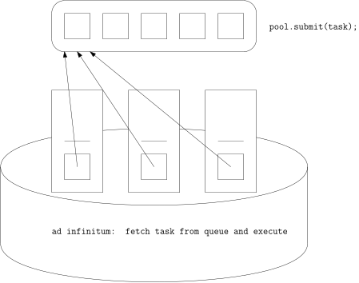
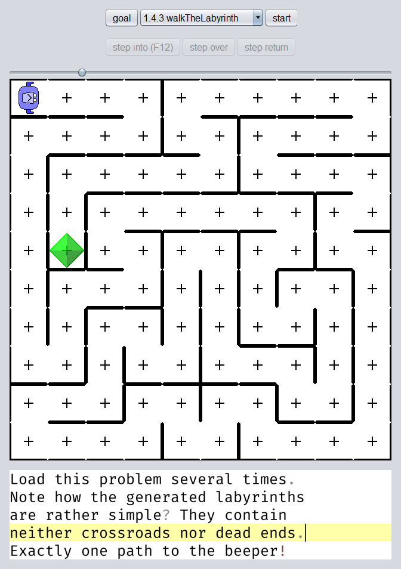
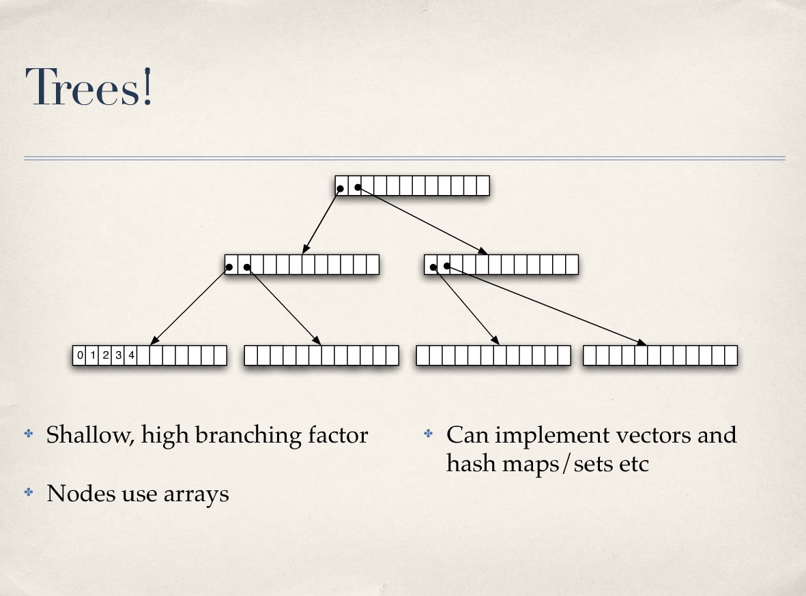
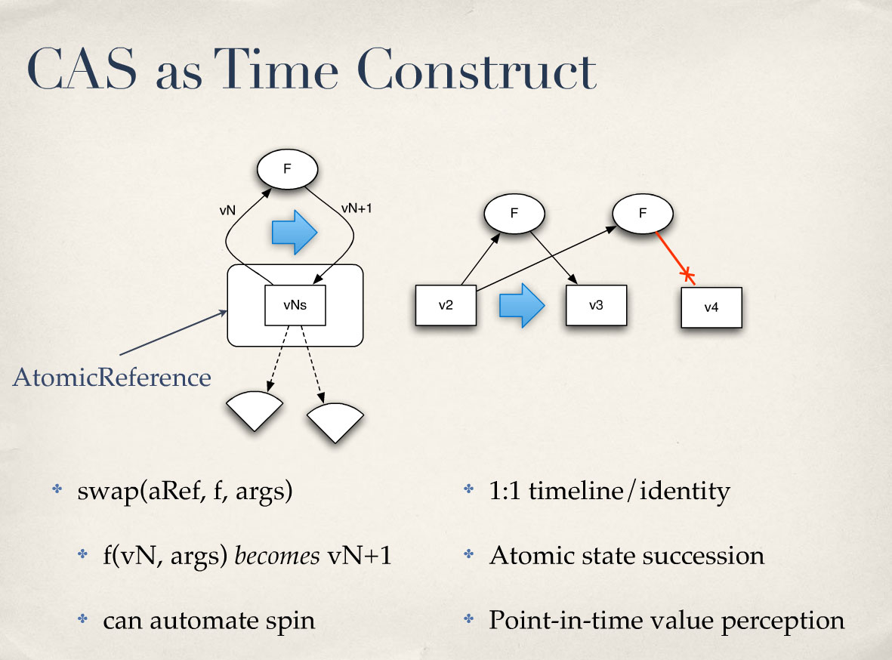

# Agenda

1. Threads
   - Compressed `Thread` overview
   - `State` transitions
   - Starting and joining threads
2. Data parallelism
   - Embarassingly parallel problems
   - Nested data parallelism
3. Pooling
   - Executors
   - Futures
4. Synchronization
   - `synchronized`
   - `volatile`
   - Atomic variables
   - Collections
   - Explicit locks
5. Bonus
   - `ThreadLocal`
   - Custom thread pool
   - Diving deeper

# Threads

- Each thread has its own call stack



- JVM threads share one heap
  - Shared, mutable state requires synchronization (more on that later)


- JVM `Thread` objects are mapped to OS threads
  - Scheduling of threads on cores is up to the OS

## Compressed `java.lang.Thread` overview

> - A *thread* is a thread of execution in a program. The Java Virtual Machine allows an application to have multiple threads of execution running concurrently.
> - Every thread has a **priority**.
> - Each thread may or may not also be marked as a **daemon**.
>   - When a Java Virtual Machine starts up, there is usually a single **non-daemon** thread (which typically calls the method named `main` of some designated class).
>   - The Java Virtual Machine continues to execute threads until [...] all non-daemon threads have died

```java
public class Thread implements Runnable {
    // ...
    public static native void sleep(long millis) throws InterruptedException;

    public static native Thread currentThread();

    public StackTraceElement[] getStackTrace();

    // ... LOTS of constructors ...
    public Thread(Runnable target);

    public synchronized void start();

    public final void join() throws InterruptedException;

    public void interrupt();
    public boolean isInterrupted();
    public static boolean interrupted();
}
```

## `java.lang.Thread.State` transitions


## Starting and joining threads

```java
Runnable task = () -> {
    // ... work to be done in parallel ...
};
Thread thread = new Thread(task);
thread.start(); // start parallel work

// ... continue working in current thread ...

thread.join();  // wait for parallel work to finish
```

# Data parallelism

## Motivating exercise

- Open the `Sum` class and navigate to the `parallelLoop` method
- Perform one of the 2 loops in another thread
  - This is *not* as simple as it may seem at first glance!
- Write down any questions or stumbling blocks that arise in the process
  - Ask for help if you get stuck!
- Is your solution as efficient as the `parallelStream` method?

## Discussion

- Split problem into parts and solve them in parallel
  - Granularity of sub-problems?
  - How many threads?


- An optimization for multi-core processors
  - Harder to implement than sequential version
  - Slower on single-core processors!
  - Multi-core processors entered the mainstream around 2006

## Case study: Font scaling



```java
Front[] fronts = new Front[13];
fronts[12] = Front.read("/font.png");                              //  6    ms

fronts[11] = fronts[12].thirdScaled(11).halfScaled().halfScaled(); // 63    ms
fronts[10] = fronts[12].thirdScaled(5).halfScaled();               // 13    ms
fronts[ 9] = fronts[12].scaled(3).halfScaled().halfScaled();       // 12    ms
fronts[ 8] = fronts[12].thirdScaled(2);                            //  2    ms
fronts[ 7] = fronts[12].thirdScaled(7).halfScaled().halfScaled();  // 25    ms
fronts[ 6] = fronts[12].halfScaled();                              //   310 µs
fronts[ 5] = fronts[10].halfScaled();                              //   210 µs
fronts[ 4] = fronts[ 8].halfScaled();                              //   130 µs
fronts[ 3] = fronts[ 6].halfScaled();                              //    75 µs
fronts[ 2] = fronts[ 4].halfScaled();                              //    33 µs
```

- `fronts[11]` takes longer than all others combined
  - Move to separate thread
  - No gain in additional threads
- Cold measures about 2x
  - 125 ms can be noticeable
  - Even more on older hardware

```java
Thread eleven = new Thread(new Runnable() {
    @Override
    public void run() {
        // 11 is the most expensive by a long shot
        fronts[11] = fronts[12].thirdScaled(11).halfScaled().halfScaled();
    }
});
eleven.start();
fronts[10] = fronts[12].thirdScaled(5).halfScaled();
fronts[ 9] = fronts[12].scaled(3).halfScaled().halfScaled();
fronts[ 8] = fronts[12].thirdScaled(2);
fronts[ 7] = fronts[12].thirdScaled(7).halfScaled().halfScaled();
fronts[ 6] = fronts[12].halfScaled();
fronts[ 5] = fronts[10].halfScaled();
fronts[ 4] = fronts[ 8].halfScaled();
fronts[ 3] = fronts[ 6].halfScaled();
fronts[ 2] = fronts[ 4].halfScaled();
eleven.join();
```

- About 200 µs overhead for
  - `new Thread`
  - `start`
  - `join`

## Embarassingly parallel problems

- Determine number of cores n
- Split problem into n *equal* parts
- Execute sub-problems on n threads


## Exercise

- Open the `Mandelbrot` class and navigate to the `calculate` method
- Split the calculation into multiple threads
  - `Runtime.getRuntime().availableProcessors()`

## Nested data parallelism

- Recursive splitting
- Splits may be unbalanced
- Usually much more parts than cores


## Case study: Quicksort

- Efficient sorting algorithm invented by Tony Hoare
  - O(n log n) average case
  - In situ
  - Unstable
  - Cache-friendly
- Partition elements by arbitrary pivot element
- Recurse on partitions with multiple elements



- Can degrade to O(n^2) depending on:
  - Pivot picking strategy
  - Handling of equal elements
- Usually combined with other sorting algorithms
  - Detect malicious input and switch to Heapsort
  - Stop recursion for small inputs and switch to Insertionsort:



## Exercise

- Open the `Quicksort` class and navigate to the recursive `quicksort(int[] a, int left, int right)` method
- Parallelize the algorithm with Fork/Join:

```java
ForkJoinPool.commonPool().invoke(new MyAction( /* problem arguments */ ));

class MyAction extends RecursiveAction {
    public MyAction( /* problem parameters */ ) {
        // ...
    }

    @Override
    protected void compute() {
        if (problemIsSmall) {
            solveDirectly();
        } else {
            MyAction first = new MyAction( /* sub-problem arguments */ );
            MyAction second = new MyAction( /* sub-problem arguments */ );
            invokeAll(first, second);
        }
    }
}
```

# Pooling

- Re-use threads instead of creating new threads all the time



## Executors

```java
private ExecutorService single = Executors.newSingleThreadExecutor();
private ExecutorService fixed  = Executors.newFixedThreadPool(8);
private ExecutorService cached = Executors.newCachedThreadPool();

// ...

fixed.execute(myRunnable);

// ...

fixed.shutdown();
```

## Futures

- `void ExecutorService.execute(Runnable command)` is fire-and-forget
- `Future<T> ExecutorService.submit(Callable<T> task)` returns a `Future` than can be queried for the result later
- `Future<?> ExecutorService.submit(Runnable task)` can at least be queried for completion

```java
private static final ExecutorService pool = Executors.newFixedThreadPool(2);

private static int parallelLoop(int[] a) throws InterruptedException, ExecutionException {
    Future<Integer> first = pool.submit(split(a, 0, PROBLEM_SIZE / 2));
    Future<Integer> second = pool.submit(split(a, PROBLEM_SIZE / 2, PROBLEM_SIZE));
    return first.get() + second.get();
}

private static Callable<Integer> split(int[] a, int fromInclusive, int toExclusive) {
    return () -> {
        int sum = 0;
        for (int i = fromInclusive; i < toExclusive; ++i) {
            sum += a[i];
        }
        return sum;
    };
}
```

## Case study: Labyrinth generation



> Sometimes, due to "bad luck" with the random number generator, the labyrinth generation algorithm causes a noticeable pause.
>
> A practical fix is to run the algorithm multiple times in parallel and let the quickest execution "win".

```java
class LabyrinthGenerator implements Callable<Labyrinth> {
    private static final int N = 16;

    public static Labyrinth generate() {
        var pool = Executors.newFixedThreadPool(N);
        var service = new ExecutorCompletionService<Labyrinth>(pool);
        for (int i = 0; i < N; ++i) {
            service.submit(new LabyrinthGenerator());
        }
        Future<Labyrinth> future = service.take();
        Labyrinth labyrinth = future.get();
        pool.shutdownNow();
        return labyrinth;
    }

    @Override
    public Labyrinth call() {
        // ...
        if (Thread.currentThread().isInterrupted()) {
            // some other generator found a result, abort
        }
        // ...
    }
}
```

Recent refactoring:

```java
class LabyrinthGenerator implements Callable<Labyrinth> {
    private static final int N = 16;
    private static final ExecutorService pool = Executors.newFixedThreadPool(N);

    public static Labyrinth generate() {
        List<LabyrinthGenerator> generators = Stream.generate(LabyrinthGenerator::new)
                                                    .limit(N)
                                                    .collect(Collectors.toList());
        return pool.invokeAny(generators);
    }

    @Override
    public Labyrinth call() {
        // ...
        if (Thread.currentThread().isInterrupted()) {
            // some other generator found a result, abort
        }
        // ...
    }
}
```

## Completable Futures

- A `Future` must be actively queried for completion (pull)
- A `CompletableFuture` can trigger a callback on completion (push)

```java
CompletableFuture.supplyAsync(someHttpCall)
                 .thenAccept(handleResult)
                 .exceptionally(handleException);
```

- Harder to write and debug than ordinary, synchronous code
- No plans for `async`/`await` syntax sugar as in C# or JavaScript
- [Project Loom](https://wiki.openjdk.java.net/display/loom/Main) will probably make asynchronous APIs largely redundant
  - Fibers = lightweight/virtual threads

# Synchronization

> Multicore processors are just now [May 2006] becoming inexpensive enough for midrange desktop systems.
> Not coincidentally, many development teams are noticing more and more threading-related bug reports in their projects.
> Dion Almaer, former editor of TheServerSide, recently blogged (after a painful debugging session that ultimately revealed a threading bug) that **most Java programs are so rife with concurrency bugs that they work only 'by accident'.** [JCIP]

## Concurrency in frameworks

> It would be nice to believe that concurrency is an 'optional' or 'advanced' language feature, but the reality is that nearly all Java applications are multithreaded and these frameworks do not insulate you from the need to properly coordinate access to application state. [JCIP]

### Swing

Can you see how the folling Swing example is broken?

```java
public class GUI {
    public static void main(String[] args) {
        JButton button = new JButton("Click me to see the current date!");
        button.addActionListener(event -> {
            button.setText(new Date().toString());
        });

        JFrame frame = new JFrame("Close me!");
        frame.add(button);
        frame.pack();
        frame.setVisible(true);
        frame.setDefaultCloseOperation(JFrame.EXIT_ON_CLOSE);
    }
}
```

The UI is put together in the main thread, but Swing requires most UI-related actions to happen in the [event dispatch thread](https://docs.oracle.com/javase/tutorial/uiswing/concurrency/dispatch.html):

```java
public class GUI {
    public static void main(String[] args) {
        EventQueue.invokeLater(() -> {
            JButton button = new JButton("Click me to see the current date!");
            button.addActionListener(event -> {
                button.setText(new Date().toString());
            });

            JFrame frame = new JFrame("Close me!");
            frame.add(button);
            frame.pack();
            frame.setVisible(true);
            frame.setDefaultCloseOperation(JFrame.EXIT_ON_CLOSE);
        });
    }
}
```

### Spring WebMVC

Can you see how the following Spring example is broken?

```java
@RestController
@RequestMapping("books")
public class BookController {

    private List<Book> books = new ArrayList<>();

    public BookController() {
        books.add(new Book("Effective Java", "Joshua Bloch", 2017));
        books.add(new Book("Java Concurrency in Practice", "Brian Goetz", 2006));
    }

    @GetMapping
    public Iterable<Book> getAllBooks() {
        return books;
    }

    @GetMapping("{index}")
    public Book getBookAt(@PathVariable("index") int index) {
        return books.get(index);
    }

    @PostMapping
    public Iterable<Book> addBook(@RequestBody Book newBook) {
        books.add(newBook);
        return books;
    }
}
```

Web requests are usually served by multiple threads, so **all** accesses to the list have to be synchronized:

```java
    @GetMapping
    public Iterable<Book> getAllBooks() {
        synchronized (books) {
            return books;
        }
    }

    @GetMapping("{index}")
    public Book getBookAt(@PathVariable("index") int index) {
        synchronized (books) {
            return books.get(index);
        }
    }

    @PostMapping
    public Iterable<Book> addBook(@RequestBody Book newBook) {
        synchronized (books) {
            books.add(newBook);
            return books;
        }
    }
```

> Whenever more than one thread accesses a given state variable, and one of them might write to it, they all must coordinate their access to it using synchronization.
> You should avoid the temptation to think that there are 'special' situations in which this rule does not apply. [JCIP]

## Goals of synchronization

Synchronization achieves 2 goals:
1. **Mutual exclusion:** Only one thread at a time can enter a synchronized block guarded by the same lock
2. **Visibility:** Changes made by one thread become visible to another thread synchronizing on the same lock

### Mutual exclusion

```java
public class UniqueIdGenerator {
    private static long id = 0L;
    
    public static long next() {
        return id++;
    }
}
```

What happens if two threads try to increment `id` at (roughly) the same time?


- Only one thread at a time can enter a synchronized block (or method) guarded by the same monitor

### Visibility

What happens if two threads try to increment `id` *after* one another?


Without proper synchronization, Thread #2 could read either a 1 or a 0. Why does this happen?

1. `javac` optimizations
2. HotSpot optimizations
3. Instruction reordering
4. Cache hierarchies

```java
public class UniqueIdGenerator {
    private static long id = 0L;

    public static long next() {
        synchronized (UniqueIdGenerator.class) {
            return id++;
        }
    }
}
```


- *All* writes in Thread #1 before a `monitorexit` become visible to Thread #2 after a `monitorenter` on the same monitor
- The visibility is *not* affected by:
  - The `monitorenter` in Thread #1
  - The `monitorexit` in Thead #2

## Synchronized methods

- A `synchronized` method behaves like a method consisting of a `synchronized (this)` block
  - Synchronizing on `this` allows clients to participate in the synchronization policy
- A `static synchronized` method behaves like a `static` method consisting of a `synchronized (The.class)` block

## Spin locks

Can you see how the following program is broken?

```java
public class Spinner {
    public static void main(String[] args) {
        Spinner spinner = new Spinner();
        new Thread(spinner::calculate).start();
        spinner.spin();
        spinner.print();
    }

    private int[] squares;
    private boolean done;

    private void calculate() {
        squares = IntStream.range(0, 46341).map(x -> x * x).toArray();
        System.out.println("Squares calculated!");
        done = true;
    }

    private void spin() {
        int spinning = 0;
        while (!done) {
            ++spinning;
        }
        System.out.println("Spinlock span " + spinning + " times!");
    }

    private void print() {
        IntStream.of(squares).limit(11).forEach(System.out::println);
    }
}
```

The write to `done` and the read from `done` happen in different threads without synchronization.
It is impossible to predict whether or not the spinlock will ever terminate.

## volatile

The simplest solution is to mark `done` with `volatile`:

```java
    private volatile boolean done;
```


Writing to a `volatile` variable *v* from Thread #1
and then reading from the same `volatile` variable *v* from Thread #2
has the same visibility guarantees as leaving a synchronized block guarded by a monitor *m* in Thread #1
and then entering a synchronized block guarded by the same monitor *m* in Thread #2.

> A program that omits needed synchronization might appear to work, passing its tests and performing well for years, but it is still broken and may fail at any moment. [JCIP]

## Atomic types

```java
public class UniqueIdGenerator {
    private static long id = 0L;

    public static long next() {
        synchronized (UniqueIdGenerator.class) {
            return id++;
        }
    }
}
```

Synchronized access to a `long` variable can be replaced with an `AtomicLong`:

```java
import java.util.concurrent.atomic.AtomicLong;

public class UniqueIdGenerator {
    private static AtomicLong id = new AtomicLong(0L);

    public static long next() {
        return id.getAndIncrement();
    }
}
```

- Implemented with special hardware instructions
  - No locking required
  - Usually faster than `synchronized`
- Other popular atomic types:
  - `AtomicInteger`
  - `AtomicBoolean`
  - `AtomicReference`

## Collections

### Synchronized collections

- Vintage collections
  - `java.util.Vector`
  - `java.util.Hashtable`
- `Collections.synchronizedXyz`, popular variants:
  - `synchronizedCollection`
  - `synchronizedList`
  - `synchronizedSet`
  - `synchronizedMap`

Note that `synchronizedList` cannot be used in our `BookController` example, because Jackson iteration is out of our control:

> It is imperative that the user manually synchronize on the returned list when traversing it via Iterator.
> Failure to follow this advice may result in non-deterministic behavior.

### Copy-on-write collections

- `CopyOnWriteArrayList`
- `CopyOnWriteArraySet`

*live coding*

Probably not the right choice for our use case, unless book additions are rare:

> A thread-safe variant of `ArrayList` in which all mutative operations are implemented by making a fresh copy of the underlying array.
>
> This is ordinarily too costly, but may be more efficient than alternatives when traversal operations vastly outnumber mutations,
> and is useful when you cannot or don't want to synchronize traversals, yet need to preclude interference among concurrent threads.

### Persistent collections

- (No relationship to databases)
- Modern alternative to copy-on-write collections
- Fully immutable (readers *never* block!)
- Efficient functional "updates"
- Shallow trees



https://github.com/matthiasn/talk-transcripts/blob/master/Hickey_Rich/AreWeThereYet.md



- Pioneered by `clojure.lang.PersistentVector` in 2007

```clojure
(ns bookstore.handler
  (:require [clojure.spec.alpha :as s]
            [compojure.core :refer :all]
            [compojure.route :as route]
            [ring.middleware.json :refer [wrap-json-response wrap-json-body]]
            [ring.util.response :refer [response]]))

(s/check-asserts true)

(s/def ::title string?)
(s/def ::author string?)
(s/def ::year int?)
(s/def ::book
  (s/keys :req-un [::title ::author ::year]))

(def books
  (atom
    [{:title "Effective Java"
      :author "Joshua Bloch"
      :year 2017}
     {:title "Java Concurrency in Practice"
      :author "Brian Goetz"
      :year 2006}]))

(run! #(s/assert ::book %) @books)

(defroutes api-routes
  (GET "/" []
    (response @books))

  (GET "/:index" [index :<< Integer/parseInt]
    (response (@books index)))

  (POST "/" {book :body}
    (s/assert ::book book)
    (response (swap! books conj book)))

  (route/not-found "Not found"))

(def app
  (-> api-routes
    (wrap-json-body {:keywords? true})
    (wrap-json-response {:pretty true})))
```

- Adopted into numerous Java libraries, e.g. `io.vavr.collection.Vector<T>`

*live coding*

### Concurrent collections

- `ConcurrentHashMap`
- `ConcurrentLinkedQueue`
- `ConcurrentLinkedDeque`
- `ConcurrentSkipListMap`
- `ConcurrentSkipListSet`

`ConcurrentHashMap` introduced 2 interesting operations which were adopted by `Map`:

```java
/**
 * @return the previous value associated with the specified key,
 * or null if there was no mapping for the key
 */
default V putIfAbsent(K key, V value) {
    V v = get(key);
    if (v == null) {
        v = put(key, value);
    }
    return v;
}

/**
 * @return the current (existing or computed) value associated with the specified key,
 * or null if the computed value is null
 */
default V computeIfAbsent(K key, Function<? super K, ? extends V> mappingFunction) {
    Objects.requireNonNull(mappingFunction);
    V v;
    if ((v = get(key)) == null) {
        V newValue;
        if ((newValue = mappingFunction.apply(key)) != null) {
            put(key, newValue);
            return newValue;
        }
    }
    return v;
}
```

### Exercise

- Open the `MobyDick` class and study the `main` method
  - It prints the first 23 lines of the novel
- Count the frequencies of words (case-insensitive) in the `countWords` method
  - The `regexTutorial` method demonstrates efficient word extraction
  - The `MobyDickTest` class checks whether the 12 most frequent words are counted correctly
- Can you increase the performance with parallel streams?

### Blocking queues

- `BlockingQueue`
  - `ArrayBlockingQueue`
  - `LinkedBlockingQueue`
  - `LinkedBlockingDeque`
- `BlockingDeque`
  - `LinkedBlockingDeque`

*demonstrate MainFrame*

## Explicit locks

- `synchronized` blocks implicitly lock and unlock
- Explicit locks offer finer-grained control over locking behavior

### ReadWriteLock

- A `ReadWriteLock` can be locked by one writer or *multiple* readers

*live coding*

# Bonus

## ThreadLocal

Consider the following code:

```java
public class NumberFormatter {
    public static String format(double number) {
        DecimalFormat numberFormat = new DecimalFormat();

        numberFormat.setDecimalFormatSymbols(new DecimalFormatSymbols(Locale.GERMAN));
        numberFormat.setMinimumFractionDigits(2);
        numberFormat.setMaximumFractionDigits(2);
        numberFormat.setGroupingUsed(false);

        return numberFormat.format(number);
    }
}
```

Is the following refactoring legal?

```java
public class NumberFormatter {
    private static final DecimalFormat numberFormat;

    static {
        numberFormat = new DecimalFormat();
        numberFormat.setDecimalFormatSymbols(new DecimalFormatSymbols(Locale.GERMAN));
        numberFormat.setMinimumFractionDigits(2);
        numberFormat.setMaximumFractionDigits(2);
        numberFormat.setGroupingUsed(false);
    }

    public static String format(double number) {
        return numberFormat.format(number);
    }
}
```

Buried inside 327 lines of `NumberFormat` class documentation:

> Decimal formats are generally not synchronized.
>
> **It is recommended to create separate format instances for each thread.**
>
> If multiple threads access a format concurrently, it must be synchronized externally.

That's where `java.lang.ThreadLocal` comes in:

```java
public class NumberFormatter {
    private static final ThreadLocal<DecimalFormat> numberFormat = ThreadLocal.withInitial(() -> {
        DecimalFormat numberFormat = new DecimalFormat();

        numberFormat.setDecimalFormatSymbols(new DecimalFormatSymbols(Locale.GERMAN));
        numberFormat.setMinimumFractionDigits(2);
        numberFormat.setMaximumFractionDigits(2);
        numberFormat.setGroupingUsed(false);

        return numberFormat;
    });

    public static String format(double number) {
        return numberFormat.get().format(number);
    }
}
```

Existing usage of `ThreadLocal` in our code base:

```java
public class CommonConfiguration extends AbstractConfiguration {
    // We use EntityManager manually, but it's not threadsafe. Hence one per thread.
    private ThreadLocal<EntityManager> _threadLocalEntityManager;

    CommonConfiguration() {
        // ...
        _threadLocalEntityManager = ThreadLocal.withInitial(() -> getSessionFactory().createEntityManager());
    }
    //...
}
```

## Custom thread pool

Writing our own thread pool is a great way to learn about `wait` and `notify` primitives:

```java
public class FredPool {
    private final Thread[] threads;
    private final Deque<Runnable> tasks = new LinkedList<>();

    public FredPool(int numThreads) {
        // ...
    }

    public void shutdown() {
        // ...
    }

    public void submit(Runnable task) {
        // ...
    }

    public <V> Fuchur<V> submit(Callable<V> callable) {
        // ...
    }
}
```

## Diving deeper

- [Brian Goetz – Java Concurrency in Practice](https://jcip.net)
- [Jeremy Manson – The Java Memory Model](https://www.youtube.com/watch?v=WTVooKLLVT8)
- [Cay Horstmann – Concurrency for Humans](https://www.youtube.com/watch?v=Zm3OgyQfDTU)
- [Douglas Hawkins – Concurrency Concepts in Java](https://www.youtube.com/watch?v=ADxUsCkWdbE)
- [Brian Goetz – Thinking in Parallel](https://www.youtube.com/watch?v=2nup6Oizpcw&t=1545)
